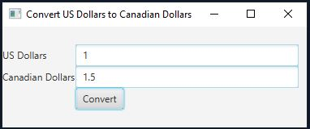

# Unit 2 Project

Write a program that converts US dollars into Canadian dollars, as shown in the following figure. The program let the user enter an amount in US dollars and display it equivalent value in Canadian dollars when clicking the Convert button. One dollar is 1.5 Canadian dollars.

## Example Output



## Analysis Steps

Well regarding the description that was given to me on the canvas assignment it seems that I have to develop a simple GUI or user interface that converts US Dollars to 
Canadian Dollars. The math is shown in the picture of what a canadian dollar equals to one US Dollar so this program should be easy to make.

### Design

No I only used one class and I basically made one single pane where I added all the requirements to the GUI, the textfields and the button. 
Then once that was implemented I did a simple PressButton event and added the math needed for the conversion inside the event.

```
GridPane pane = new GridPane();
        pane.setAlignment(Pos.CENTER_LEFT);
        pane.add(new Label("US Dollars"), 0, 0);
        pane.add(USDollars, 1, 0);
        pane.add(new Label("Canadian Dollars"), 0, 1);
	pane.add(CanadianDollars, 1, 1);
        pane.add(Convert, 1, 2);
```

### Testing

Step 1: Create Text Fields & Button

```
protected TextField USDollars = new TextField();
	protected TextField CanadianDollars = new TextField();
        protected Button Convert = new Button("Convert");
```
Step 2: Create Pane

```
GridPane pane = new GridPane();
        pane.setAlignment(Pos.CENTER_LEFT);
        pane.add(new Label("US Dollars"), 0, 0);
        pane.add(USDollars, 1, 0);
        pane.add(new Label("Canadian Dollars"), 0, 1);
	pane.add(CanadianDollars, 1, 1);
        pane.add(Convert, 1, 2);
```
Step 3: Styles
```
  USDollars.setStyle("-fx-border-color: LIGHTBLUE");
                USDollars.setPrefWidth(275);
                USDollars.setMaxWidth(275);
                CanadianDollars.setStyle("-fx-border-color: LIGHTBLUE");
                Convert.setStyle("-fx-border-color: LIGHTBLUE");
```
Step 4: 
```
Create Method for Button to work
```
Convert.setOnMousePressed(e -> {
          
            if(!USDollars.getText().equals("")){
                double Dollars = Double.parseDouble(USDollars.getText());
                double CDollars = Dollars * 1.5;
                CanadianDollars.setText("" + CDollars);
            }
      
        });
```
Step 5: Create a scene and place it in the stage
```
Scene scene = new Scene(pane, 375, 125);
        primaryStage.setScene(scene);
        primaryStage.setTitle("Convert US Dollars to Canadian Dollars");
        primaryStage.show();
```
```

You can get some data out of this by entering a dollar value decimal or whole and convert it into a canadian dollar
for example if you put 1 dollar, you get 1.50 dollars in canadian.

## Notes

No issues or notes.

## Do not change content below this line
## Adapted from a README Built With

* [Dropwizard](http://www.dropwizard.io/1.0.2/docs/) - The web framework used
* [Maven](https://maven.apache.org/) - Dependency Management
* [ROME](https://rometools.github.io/rome/) - Used to generate RSS Feeds

## Contributing

Please read [CONTRIBUTING.md](https://gist.github.com/PurpleBooth/b24679402957c63ec426) for details on our code of conduct, and the process for submitting pull requests to us.

## Versioning

We use [SemVer](http://semver.org/) for versioning. For the versions available, see the [tags on this repository](https://github.com/your/project/tags). 

## Authors

* **Billie Thompson** - *Initial work* - [PurpleBooth](https://github.com/PurpleBooth)

See also the list of [contributors](https://github.com/your/project/contributors) who participated in this project.

## License

This project is licensed under the MIT License - see the [LICENSE.md](LICENSE.md) file for details

## Acknowledgments

* Hat tip to anyone who's code was used
* Inspiration
* etc
